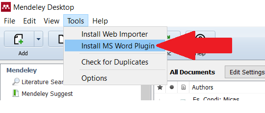

##Download

Os sistemas operacionais que o Mendeley está apto a ser instaladas são Windows 7 ou superior, Mac OS e  Linux. Para a download do Mendeley, acesse <http://www.mendeley.com>, conforme instruções abaixo:

##Registro

O registro no site é obrigatório para a utilização do programa, no entanto é fundamental para acessar os serviços disponibilizados pelo Mendeley, como a partilha de informações com outros pesquisadores, a sincronização da sua base de dados (importantíssmo para a segurança dos arquivos), o acesso aos grupos de pesquisas a criação de grupos por parte do acadêmico e a utilizaçã da ferramenta *Web Importer*, que será tratada posteriormente.

O cadastro no site é gratuito, simples e exige algumas informações que serão utilizadas para que o site direcione conteúdos apropriados de acordo com o interesse do pesquisador. 

##Sobre o Mendeley

Abaixo constam os menus do Mendeley, o qual serão descritos como segue:

1. Este menu possibilita a importação dos documentos para o Mendeley, sejam aqueles que estão salvos no computador, ou mesmo aquelas entradas manuais que serão necessárias (por exemplo no caso dos livros impressos que possua); de forma adicional podem ser incluídas pastas inteiras de documentos provenientes no seu computador ou; marcar as pastas em que o Mendeley irá acompanhar, pois qualquer documento incluso será automaticamente arquivado no programa.

2. Este item permite criar nova pasta dentro do Mendeley.
3. Permite excluir as pastas do Mendeley.
4. Este botão faz com que o Mendeley procure materiais relacionados para o usuário.
5. Este item sincroniza os arquivos do Mendeley com o Mendeley Web (vice-versa).
6. Ajuda do Mendeley.

###Como criar uma pasta:

Segue outra forma de criação de pastas no Mendeley.

###Importando arquivos manualmente:

Uma forma comum de importação dos arquivos no Mendeley é manualmente, daqueles artigos ou materiais que já possui em seu computador. Segue abaixo a ilustração do processo, notando que o programa extrai as informações possíveis do arquivo, como Autor, Título, Revista, Ano, etc. Também, tenta buscar as informações faltantes, nem sempre com sucesso ou com perícia (é importante conferir estas informações!). No entanto, quando existem informações faltando, o usuário pode facilmente completá-las:

###Adicionando pastas de documentos
Outro recurso é a importação de pastas inteiras para dentro do Mendeley:

###Monitoramento de pastas

O Mendeley possibilita o monitoramento de uma determinada pasta em seu computador, para que automaticamente o programa o inclua em sua biblioteca à medida em que o usuário for salvando os arquivos dentro deste local:

###Entradas manuais

Em alguns casos, o pesquisador possui o livro ou outro material físico mas não na forma digital, mas necessita que seja efetuada a gestão desta bibliografia para futuras citações. O Mendeley possibilita a entrada manual da bibliografia para estes casos:

##Web Importer

O serviço **Web Importer** do Mendeley facilitará a importação dos documentos diretamente dos navegadores de internet para a sua livraria.

###Instalação do Web Importer

Para instalação, acesse <https://www.mendeley.com/reference-management/web-importer> e instale o plugin no navegador desejado.

Exemplo:

###Utilização do Web Importer

Após achar o trabalho desejado, basta utilizar o Web Importer para sincronizar o documento "pdf", por exemplo, para o Mendeley,   sendo possível escolher em qual pasta deseja arquivá-lo:

#Utilização no Microsoft Word

A utilização e integração do programa no Microsoft Word se dá com a instalação de um plugin do Mendeley. Será acessado na aba Referências do Word. De forma adicional, pode-se escolher entre os diversos estilos de formatação (APA, Chicago, ABNT, etc)^[Utilidade: no site <http://editor.citationstyles.org/searchByName/> podem ser encontradas outras normas para citações e referências, bem como possibilita a alteração e a criação de um estilo já existente ou desejado.], sendo que interessa-nos selecionar o estilo da Associação Brasileira de normas Técnicas - ABNT.

##Citações 

Para efetuarem-se as citações no texto desejado, na aba Referências do Word, clique em *Insert Citation* e digite o artigo desejado, lembrando que o Mendeley reconhece o autor desejado, ou mesmo o título do trabalho e também as informações que constam no texto do mesmo. 

###Inserindo as Citações
O exemplo abaixo mostra a citação entre parênteses, com mais de um autor, com dois trabalhos do mesmo autor no mesmo ano e com autores diferentes. Ainda, é possível inserção da página da qual foi retirada a referência, bem como suprimir o autor, mostrando em consequência somente o ano e/ou ano e página:

###Alterando as Citações

Adicionalmente, é possível efetuar a formatação da citação feita com o Mendeley dentro do Word, clicando-se dentro da citação no texto e alterando seu conteúdo. Importante lembrar que não é desejável fazer este procedimento, pois dificulta a alternância entre os estilos bibliográficos para este item alterado.

##Inserir Bibliografia

Após a inclusão das citações no decorrer do texto, importa elencar as referências bibliográficas utilizadas no texto, respeitando sua respectiva formatação de acordo com a norma utilizada. No *plugin* do Mendeley, basta acessar *Insert Bibliography*, no capítulo das referências:

A alteração do estilo das referências e consequentemente da formatação das citações ao longo do texto é feito de maneira automática:

