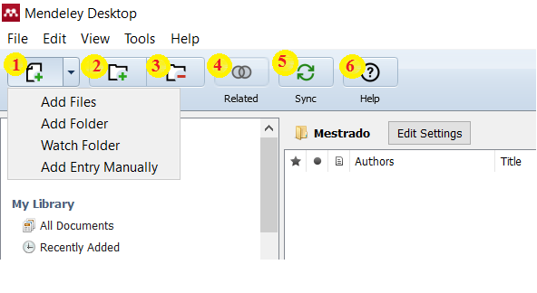
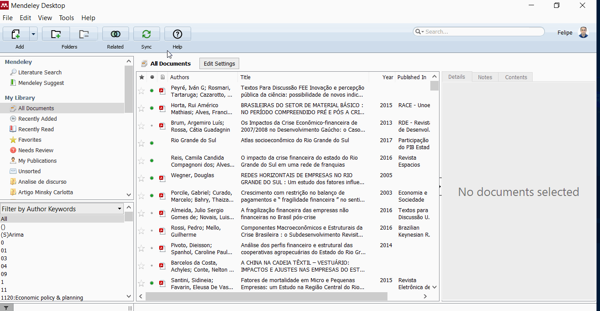
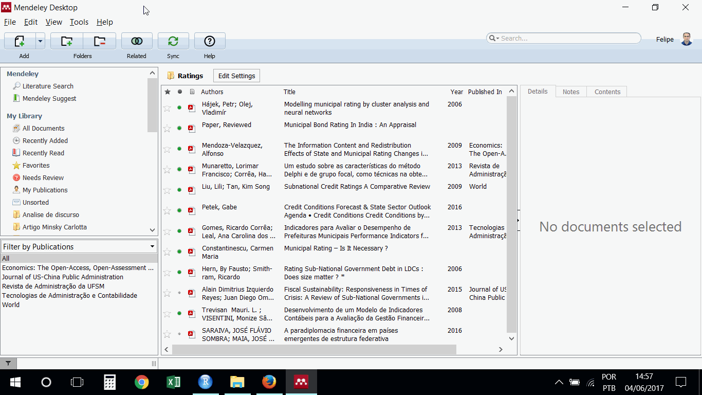
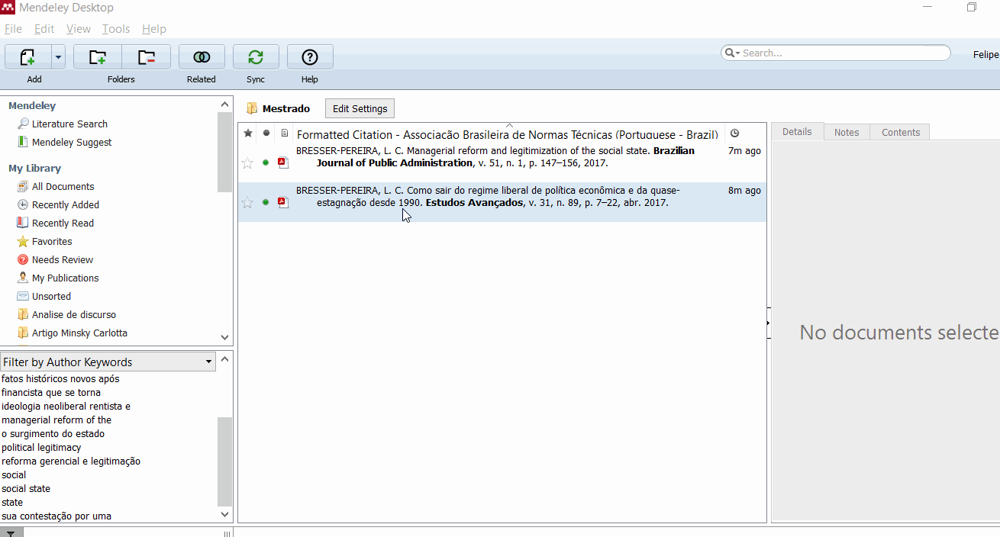
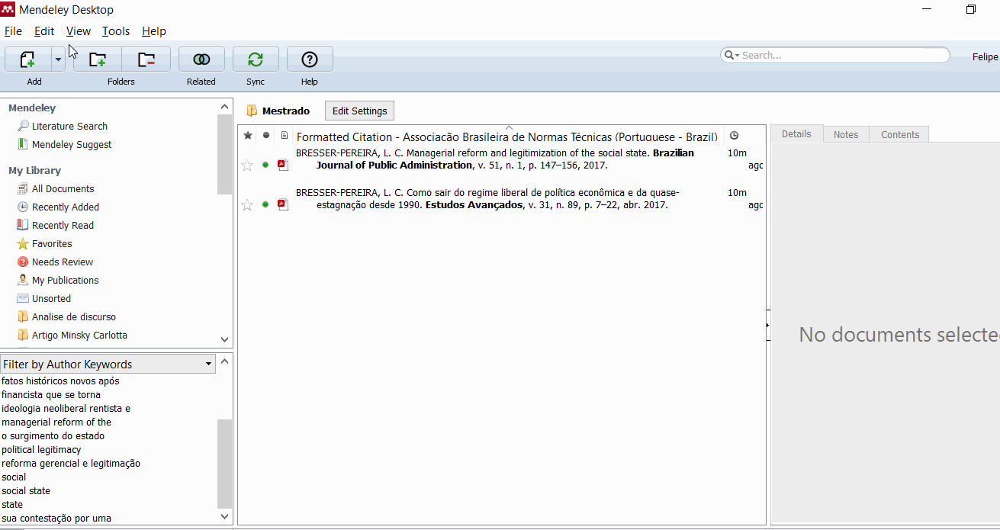

Abaixo constam os menus do Mendeley, o qual serão descritos como segue:

1. Este menu possibilita a importação dos documentos para o Mendeley, sejam aqueles que estão salvos no computador, ou mesmo aquelas entradas manuais que serão necessárias (por exemplo no caso dos livros impressos que possua); de forma adicional podem ser incluídas pastas inteiras de documentos provenientes no seu computador ou; marcar as pastas em que o Mendeley irá acompanhar, pois qualquer documento incluso será automaticamente arquivado no programa.

2. Este item permite criar nova pasta dentro do Mendeley.
3. Permite excluir as pastas do Mendeley.
4. Este botão faz com que o Mendeley procure materiais relacionados para o usuário.
5. Este item sincroniza os arquivos do Mendeley com o Mendeley Web (vice-versa).
6. Ajuda do Mendeley.

###Como criar uma pasta:

Segue outra forma de criação de pastas no Mendeley.

###Importando arquivos manualmente:

Uma forma comum de importação dos arquivos no Mendeley é manualmente, daqueles artigos ou materiais que já possui em seu computador. Segue abaixo a ilustração do processo, notando que o programa extrai as informações possíveis do arquivo, como Autor, Título, Revista, Ano, etc. Também, tenta buscar as informações faltantes, nem sempre com sucesso ou com perícia (é importante conferir estas informações!). No entanto, quando existem informações faltando, o usuário pode facilmente completá-las:

###Adicionando pastas de documentos
Outro recurso é a importação de pastas inteiras para dentro do Mendeley:

###Monitoramento de pastas

O Mendeley possibilita o monitoramento de uma determinada pasta em seu computador, para que automaticamente o programa o inclua em sua biblioteca à medida em que o usuário for salvando os arquivos dentro deste local:

###Entradas manuais

Em alguns casos, o pesquisador possui o livro ou outro material físico mas não na forma digital, mas necessita que seja efetuada a gestão desta bibliografia para futuras citações. O Mendeley possibilita a entrada manual da bibliografia para estes casos:

