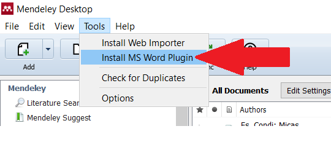

A utilização e integração do programa no Microsoft Word se dá com a instalação de um plugin do Mendeley. Será acessado na aba Referências do Word. De forma adicional, pode-se escolher entre os diversos estilos de formatação (APA, Chicago, ABNT, etc)^[Utilidade: no site <http://editor.citationstyles.org/searchByName/> podem ser encontradas outras normas para citações e referências, bem como possibilita a alteração e a criação de um estilo já existente ou desejado.], sendo que interessa-nos selecionar o estilo da Associação Brasileira de normas Técnicas - ABNT.

