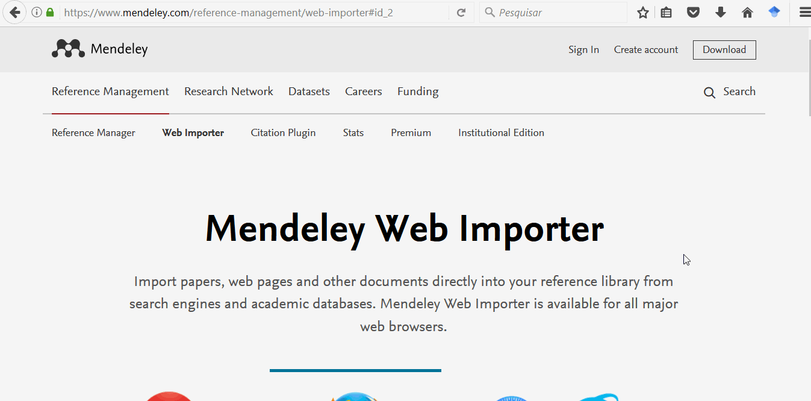

##Web Importer

O serviço **Web Importer** do Mendeley facilitará a importação dos documentos diretamente dos navegadores de internet para a sua livraria.

###Instalação do Web Importer

Para instalação, acesse <https://www.mendeley.com/reference-management/web-importer> e instale o plugin no navegador desejado.

Exemplo:

###Utilização do Web Importer

Após achar o trabalho desejado, basta utilizar o Web Importer para sincronizar o documento "pdf", por exemplo, para o Mendeley,   sendo possível escolher em qual pasta deseja arquivá-lo:

